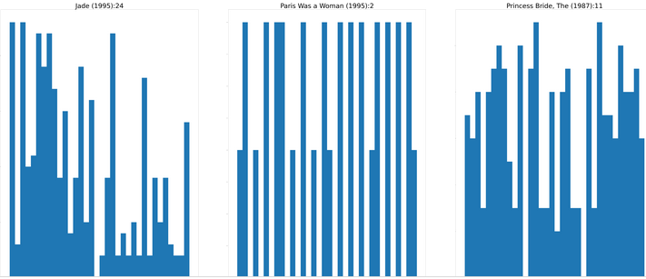

# Movies and Latent Factors

##  Introduction This blogs describes my search to understand FASTAI language classification,the phases are as follows:

    Chapter 10 : NLP Deep Dive using the pretrained language model and IMDB build a classifier
    Chapter 8 : Collaborative Filtering Deep Dive using Movie Lens to create the latent factors
    From the latent factors identify the highest values per movie
    Assign the latent factors as multicategories to the reviews per movie
    Chapter 6: Other Computer Vision Problem - Multi-Label Classification
    Perform a classification of all the movie reviews using the Wiki-IMDB encoder and vocab
    Produce frequency analysis of the categories for all the reviews per movie
    Remove the most frequent category because of domination
    Produce frequency analysis of the categories for all the reviews per movie
    
 ## Chapter 10 : NLP Deep Dive using the pretrained language model and IMDB build a classifier
    path=untar_data(URLs.IMDB) #/root/.fastai/data/imdb
    get_imdb = partial(get_text_files,folders=['train','test','unsup'])
    dls_lm = DataBlock(
      blocks = TextBlock.from_folder(path,is_lm=True),
      get_items=get_imdb,splitter=RandomSplitter(0.1)
      ).dataloaders(path,path=path,bs=128,seq_len=80)
    learnlm = language_model_learner(dls_lm,AWD_LSTM,drop_mult=0.3,metrics=[accuracy, Perplexity()]).to_fp16()
    learnlm.fit_one_cycle(1,2e-2)
    learnlm.unfreeze()
    learnlm.fit_one_cycle(10,2e-3) # 8 hours on Google Colab.
    learnlm.save_encoder('finetuned') # This is the fine tuned model
    pickle.dump( dls_lm , open( "savelm3.p", "wb" ) ) # This includes the vocab.
    
 ## Chapter 8 : Collaborative Filtering Deep Dive using Movie Lens to create the latent factors
    !pip install git+https://github.com/alberanid/imdbpy # a movie review access facility
    path = untar_data(URLs.ML_100k)
    ratings = pd.read_csv(path/'u.data',delimiter='\t',header=None,names=['user','movie','rating','timestamp'])
    ratings.head()
    movies = pd.read_csv(path/'u.item',delimiter='|',encoding='latin-1',usecols=(0,1),names=('movie','title'),header=None)
    movies.head()
    ratings=ratings.merge(movies)
    ratings.head()
    dls = CollabDataLoaders.from_df(ratings,item_name='title',bs=64)
    dls.show_batch()
    learn = collab_learner(dls, n_factors=50, y_range = (0,5.5))
    learn.fit_one_cycle(5,5e-3,wd=0.1)
    
    ## From the latent factors identify the highest values per movie   
   
    
    movie_weight = learn.model.i_weight.weight
    idxs = movie_weight.argsort(descending=True)
    idxs5 = idxs[:,0:FACTORS]   # Originally 5 
    *So just pick the top latent factors per movie
    movie_weight5 = [movie_weight[i,idxs5[i]] for i in range(movie_weight.shape[0])]
    idxm5s = movie_weight[:,0].argsort(descending=True) 
    movie_weight5top = []
    for i in range(FACTORS):   
      movie_weight5top.append(movie_weight5[idxm5s[i]])
    movie_weight5toptitles = []
    for i in range(FACTORS):   
      T0 = idxm5s[i].item()  
      T1 = movies.iloc[T0].title
      movie_weight5toptitles.append(T1)
    newidxs=idxs
   * Having selected the highest per movie and 5 (FACTORS) weights then retieve movie reviews
   for i in movie_weight5toptitles:
     ia = IMDb()
     imovies = ia.search_movie(i) 
     mi = imovies[0].movieID
     imdbdata = ia.get_movie_reviews(str(mi))['data'] # ['reviews']
     if 'reviews' in imdbdata: 
       details = imdbdata['reviews']
       print(f'*** {i} *** {len(details)} reviews')
       for j in details: 
         print(j['content'])
         print('')
*now give the review the attribute;idxs contains the latency number we just need to idxm5scpu to pull the high line and generate Lx Ly Lz assoiated with text
   * Find the most common latent factors
   idxs5list=[]
   for iii in range(idxs5.shape[0]):
     for jjj in range(idxs5.shape[1]):
       idxs5list.append(idxs5[iii][jjj].item())    
   counter=collections.Counter(idxs5list);print(counter.most_common(20))
 ## Optional 
   Latency=idxs[idxm5s[:],0:FACTORS]
   * Now remove all movies with a latent factor of zero. 211 films. It is almost if latency zero = it is a film but it could be any latent number
   def tensorvaluezero(x):
     sum = False
     for i in x:
       e = i.item()
       if (e == 0.0): sum=True
     return sum
   TCList = []
   for i,v in enumerate(Latency): 
     if (tensorvaluezero(v.cpu()) == False ) : 
       TCList.append(i)
   ## Assign the latent factors as multicategories to the reviews per movie    
   md=movies.iloc[idxm5s[:].cpu()].title
   * Choose the top "Twenty" movies with the highest weight for the first latent weight
   top20movies = md.to_list()[0:Twenty]
   LatencyString=[]
   for j in Latency[0:Twenty]:
     LT =''
     temp_i = len(j)
     for k in j:
       MN = (k.item())
       temp_i -= 1
       if temp_i > 0 :
         LT=LT+str(k.item())+';'
       else: 
         LT=LT+str(k.item())    
     LatencyString.append(LT)
     *Now retrieve the reviews for these "twenty" movies. Movies may not have a review. 
   pdload=[]
   reviewCount = []
   for i in range(len(top20movies)):
     ia = IMDb()
     imovies = ia.search_movie(str(top20movies[i])) 
     if imovies != [] :
       mi = imovies[0].movieID
       imdbdata = ia.get_movie_reviews(str(mi))['data'] # ['reviews']
       if 'reviews' in imdbdata: 
         details = imdbdata['reviews']
         print(f'*** {i} *** {len(details)} reviews')
         reviewCount.append((top20movies[i],len(details)))
         for j in details:       
           pdload.append([top20movies[i],LatencyString[i],j['content']])
    * Now build a panda data frame
    dfr=pd.DataFrame(pdload,columns=['Movie','Latency','Review'])
    
   * given the reviews have now a category based on the 5 highest latent factors
    
   * Now build a dataloader but use the vocab from the Wiki/IMDB model trained earlier
   dlsr = TextDataLoaders.from_df(df=dfr, text_vocab=dls_lm.vocab,text_col='Review', label_col='Latency', 
      label_delim=";",y_block=MultiCategoryBlock,splitter=RandomSplitter(0.2) )
   dlsr.show_batch(max_n=3)
   learnr = text_classifier_learner(dlsr, AWD_LSTM, drop_mult=0.5, n_out=len(dlsr.vocab[1]), metrics=[]).to_fp16()
   learnr.load_encoder('finetunedE')
   learnr.fit_one_cycle(1,2e-2)
   learn.freeze_to(-2)
   learnr.fit_one_cycle(1,slice(1e-2/(2.6**4),1e-2))
   learn.freeze_to(-3)
   learnr.fit_one_cycle(1,slice(5e-3/(2.6**4),5e-3))
   learnr.unfreeze()
   learnr.fit_one_cycle(2,slice(1e-3/(2.6**4),1e-3))
   *Now predict the latent factors for each movie based on their reviews
   
   superpredictions=[]
   accRC=0
   for m in range(len(reviewCount)):
     RC = reviewCount[m][1]
     Film = reviewCount[m][0]
     predictions=[]
     print(f'film  {Film} reviews {RC}')
     for l in range(reviewCount[m][1]+0):
       predictions.append(learnr.predict(dfr.iloc[accRC+l,2])[0])
     accRC=accRC+RC
     superpredictions.append((Film,predictions))
   ## Produce frequency analysis of the categories for all the reviews per movie
     
   import math
   *Build a 2D shape to hold all the histograms
   matplotlib.rcParams['figure.figsize'] = [256, 64*1024/256-1]
   pict = int(math.sqrt(len(superpredictions)))+1
   if pict > 8 : pict = 8
   pictw = pict
   picth = ((len(superpredictions))//pict) + 1
   print(picth,pictw)
   _,axs = plt.subplots(picth,pictw)
   for boxcount,sp in enumerate(superpredictions):  
     reviewCountForTitle = reviewCount[boxcount][1]
     cord = (boxcount//(pictw),boxcount-(boxcount//pictw)*pictw)  
     flat_list = [item for sublist in sp[1] for item in sublist]
     flat_list.sort()
     axs[cord].hist(flat_list, density=False, bins=len(dlsr.vocab[1]))  # density=False would make counts
     axs[cord].set_title(str(sp[0]+":"+str(reviewCountForTitle)),fontsize=108) 
   plt.tight_layout()
   
    
  
    
    

    
    
